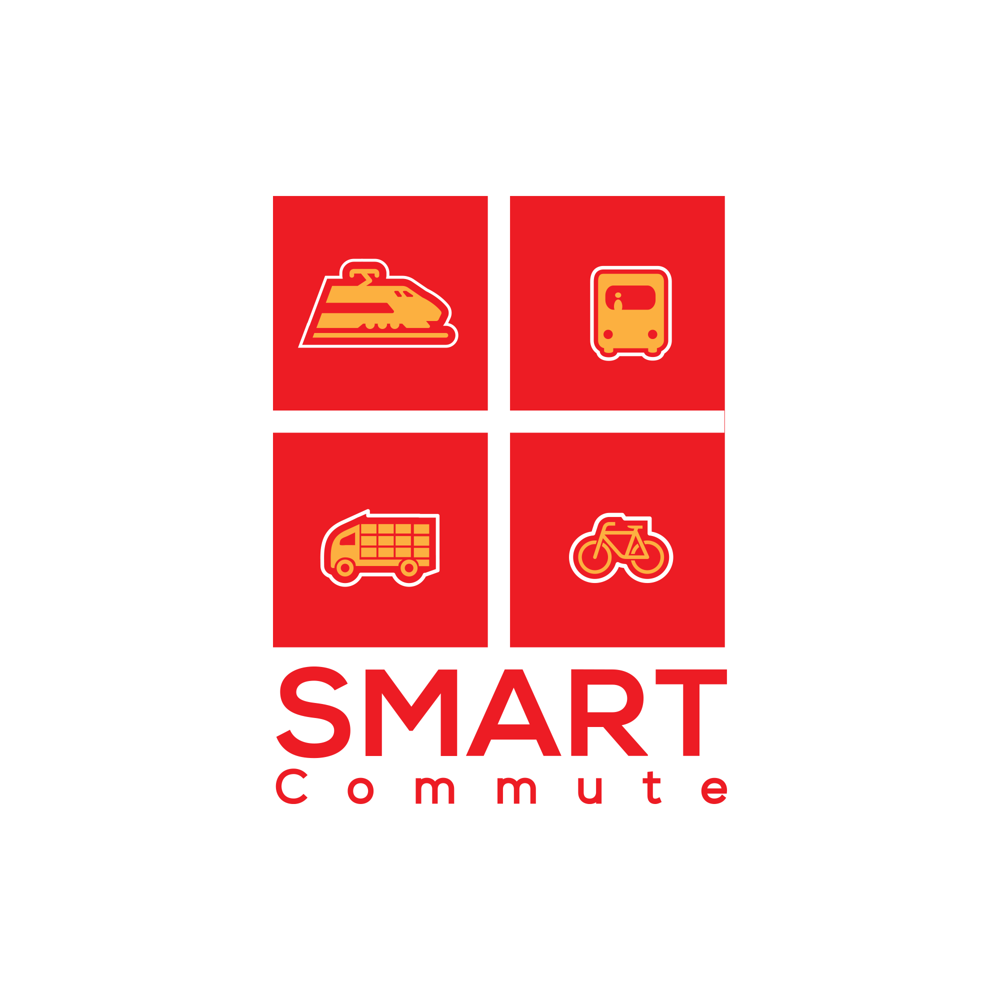
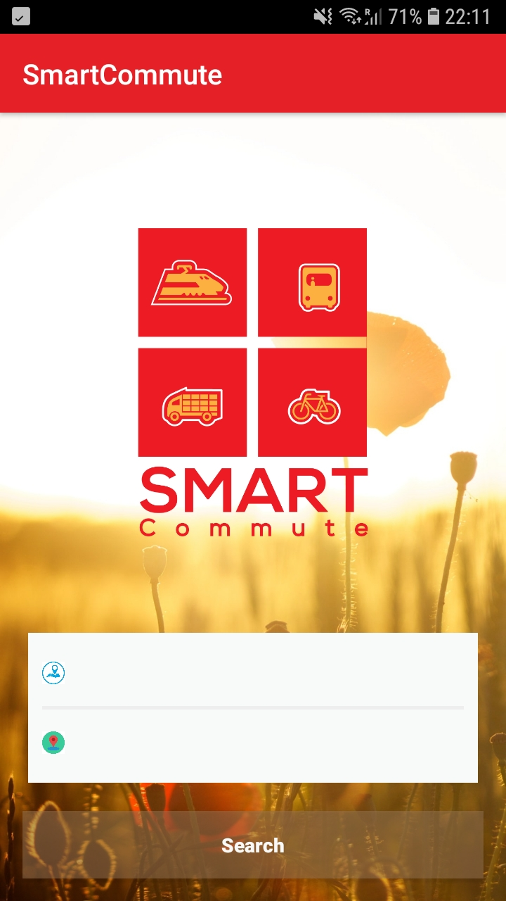
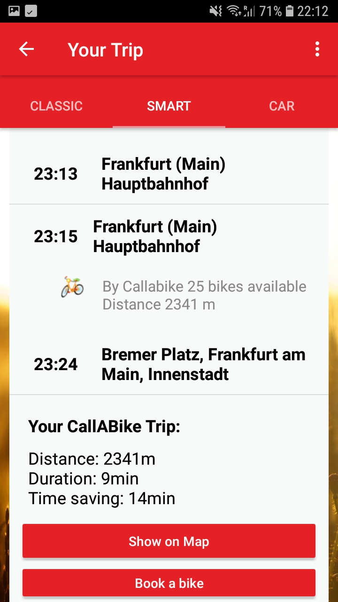
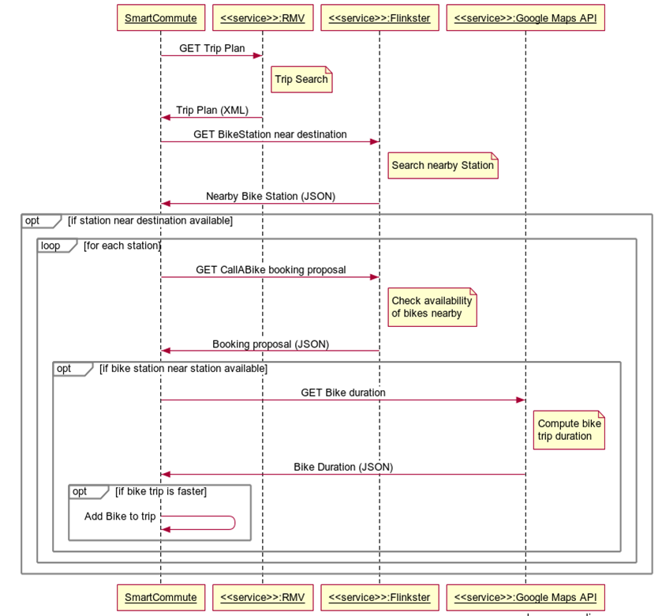

# Smart Commute

SmartCommute is an Android app that provides trip plans (in the RMV area, Germany) by combining bublic transport and bike sharing. This aims at promoting the use of bike sharing, and offering time saving options to end-users. 

In Smart cities, different modes of transport such as trams, busses, underground, bikes, cars, boats are combined. This allows user to get more efficiently from A to B. Whilst public transport and bike sharing infrastructure exist in many cities, no Application can plan trips combining those two modes of transports. Yet many customers would find such a functionality useful. SmartCommute aims to solve this issue. 

 

```
API Keys: 
The API Keys provided in the App are strictly limited in requests per time Unit.
They should therefore be used for testing purpouses only.
```

## Features

- Enables to search for public transport stations or addresses (within the RMV area)
- Shows the next public transport route 
- Optimizes the trip plan by adding CallABike services, depending on
    - Availability of CallABike Stations
    - Availability of CallABike Bikes
    - Potential time saving
- Shows the duration of the trip by car
- Is integrated with:
    - Google Maps (to visualize bike trip & allowlow navigation)
    - CallABike App (reservation link, enables direct booking)


## Data Sources

Data is collected from three sources:

- RMV API: Public transport routs & station/address IDs
- Flinkster API: CallABike stations & booking proposals
- Google Maps API: Bicyle distances and durations

The following UML diagram shows the mechanism by which the smart plan is created:



## Requirements

SmartCommute is an Android Application that will work on any device with SDK 22 or above.

## Authors

SmartCommute was created by [Xinyuan Cai](https://github.com/nannancy/) and Alex Hunziker.

The Application was written for the Data Challenge 2018 of the Goethe University Frankfurt in cooperation with DB Systel.
It has won the 2nd price of this challenge.

## Licence

This application is licenced under the [GPLv3](https://www.gnu.org/licenses/gpl-3.0.en.html).